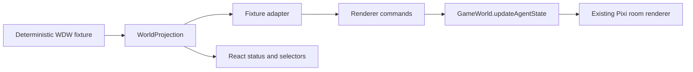

# WP3 — Semantic World Projection & Fixture Adapter

Status: complete on top of WP2 commit `88e50232270455b36409e82087dc5506a14bdeb6`.

WP3 proves the frontend loop from a semantic world fixture to the existing Pixi renderer:

## Model and ownership

The frontend-owned model lives under `website/src/world`:

- `WorldProjection` contains `generatedAt`, semantic places, and semantic residents.
- `PlaceProjection` contains only `id`, `name`, and an optional description.
- `ResidentProjection` contains identity, place, broad activity, attention, and an optional summary.
- Activity is intentionally broad: `idle`, `working`, `waiting`, `reviewing`, `communicating`, or `offline`.
- Attention is intentionally UI-facing: `none`, `info`, `needs-user`, or `blocked`.

These are view-model types, not a canonical backend contract. The fixture is the current data source. There is no live [WDW](https://github.com/Wonderful-Digital-World/wonderful-digital-world) source, backend call, database, Airtable integration, or projection service in WP3.

`GameWorld` remains renderer-focused. The adapter owns the semantic-to-renderer boundary, including room selection, renderer actions, station coordinates, facing, labels, tints, and practical fallbacks. The React room shell owns the active fixture, selected place, status surface, and development controls.

## Deterministic fixtures

All scenarios use the same four residents and four semantic places. The timestamp is fixed so identical inputs produce identical commands and browser output.

| Scenario | Visible state |
| --- | --- |
| Normal Workday | Bridget communicating, Banjo working, Coach reviewing, Mini Me idle |
| Needs Haley | Bridget needs user attention with a handoff summary; Mini Me provides information |
| Blocked | Banjo is blocked; Bridget is waiting with informational attention |
| Quiet | Bridget and Mini Me are idle; Banjo and Coach are offline |

Residents are Bridget, Banjo, Coach, and Mini Me. Places are Main Square, Workshop, Coach’s Gym, and Mini Me’s Place.

The fixture selector is explicitly labeled “development only.” It changes the projected status and renderer state locally; it does not imply production data ingestion.

## Place mapping

The mapping is explicit and centralized in `website/src/world/adapter.ts`:

| Semantic place ID | Existing renderer room |
| --- | --- |
| `main-square` | `outside` |
| `workshop` | `office` |
| `coachs-gym` | `court` |
| `mini-mes-place` | `home` |

The renderer’s five upstream room keys remain `poker`, `court`, `office`, `home`, and `outside`. `poker` is intentionally not assigned a semantic WDW place in WP3, but remains available through the renderer demo controls and baseline test.

## Stations, actions, and placement

Semantic fixtures never contain renderer coordinates. `website/src/world/placement.ts` maps a place, activity, and resident index to practical room positions based on the existing renderer’s stations and fallbacks.

| Semantic activity | Renderer action | Placement intent |
| --- | --- | --- |
| `working` | `sitting` | Desk or seated station when available |
| `reviewing` | `inspecting` | Whiteboard, court gallery, or a practical inspection fallback |
| `idle` | `idle` | Safe room idle point |
| `waiting` | `idle` | Safe visible room point |
| `communicating` | `idle` | Shared conversational point when available |
| `offline` | `idle` | Stable fallback point |

The adapter emits only the renderer’s existing `idle`, `walking`, `sitting`, and `inspecting` vocabulary; WP3 does not add semantic concepts to `GameWorld`. Unknown place IDs return a safe empty command set rather than selecting a room accidentally.

## Stable visual identity

The adapter supplies stable labels and tints for Bridget, Banjo, Coach, and Mini Me. The existing renderer also derives accessories deterministically from the stable `agentId`; WP3 therefore uses existing art and does not add sprites or a custom character system. Unknown future fixture residents receive a deterministic fallback tint derived from their ID.

## Execution

The projection path is:

1. Select a deterministic fixture and semantic place in the room shell.
2. Resolve the semantic place through the centralized room map.
3. Filter residents assigned to that place.
4. Resolve each resident’s renderer action, station placement, facing, label, and tint in the adapter.
5. Select the mapped existing room and call `GameWorld.updateAgentState` for each command.
6. Render the same resident state in the React status surface, including attention treatment and summaries.

Only one projection room is active at a time. The renderer demo controls provide access to all five upstream rooms and keep the original five-room capability observable.

## Test evidence

Focused unit coverage verifies:

- all four place mappings;
- safe failure for an unknown place;
- all six semantic activities map to valid renderer actions;
- stable named identities;
- coordinates are generated by the adapter, not stored in fixtures;
- `needs-user` attention survives into the command;
- fixture-to-command output is deterministic.

The browser smoke covers `/rooms`, all five renderer rooms, Normal Workday, Banjo in Workshop, the Workshop → `office` mapping, status agreement, Needs Haley, and Blocked. It also records every request and asserts that no non-local network request occurs.

## Limitations and future requirements

WP3 is a local semantic projection proof, not a production world feed. It does not define the canonical activity taxonomy, ingest private or public WDW state, sanitize inbox/work-item/event data, enforce a 24-hour delay, or solve production identity/privacy rules.

Before a live projection is built, the system still needs a canonical projection contract with at least:

- a backend-owned source and versioned schema;
- a stable broad activity category vocabulary and transition rules;
- explicit public/private and sanitization rules;
- freshness, delay, and error semantics;
- identity and authorization rules for projected residents;
- a runtime ingestion boundary that can replace the fixture without changing renderer ownership.

The broad activity category is deliberately deferred rather than inferred from implementation-specific events. A future WP4 should define and review that canonical projection contract and runtime ingestion boundary before connecting a real source.

## Non-goals

WP3 does not add live WDW data, a backend, a database, Airtable, Bridget/Banjo/Coach/Mini Me modifications, inbox/work-item/event/API integrations, a projection service, public/private sanitization, a 24-hour delay, a Haley site or system toggle, final navigation, new art, custom sprites, or a renderer refactor.
